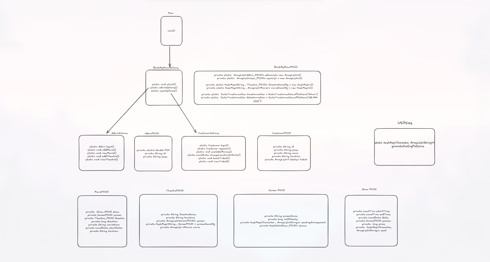

# 🎬 Theater Booking System

[](https://www.java.com)
[](https://github.com/username/theater-booking)

> A comprehensive Java project for theater management and booking operations, built for deep understanding of Java concepts and OOP principles

## 📑 Table of Contents
- [Project Purpose](#-project-purpose)
- [Project Structure](#-project-structure)
- [System Architecture](#%EF%B8%8F-system-architecture)
- [Features](#-key-features)
- [Getting Started](#-getting-started)
- [Technical Stack](#%EF%B8%8F-technical-stack)
- [Learning Outcomes](#-learning-outcomes)
- [Contributing](#-contributing)
- [License](#-license)

## 🎯 Project Purpose

This educational project demonstrates advanced Java programming concepts through a real-world application. Perfect for developers looking to master:

- ✨ Object-Oriented Programming (OOP) fundamentals
- 🏗️ System architecture design
- 📦 POJO patterns
- 🔄 Java collections framework
- ⏰ Date/time handling

## 📁 Project Structure

```
BookMyShow-Console-main/
   ├── Admin_POJO
   ├── AdminActions
   ├── BookMyShow
   ├── BookMyShow_POJO
   ├── Main
   ├── Movie
   ├── README.md
   ├── ScreenPOJO
   ├── Show_POJO
   ├── Theatre_POJO
   ├── Tickets
   ├── User_POJO
   ├── UserActions
   └── Utilities
```

## 🏗️ System Architecture

Below is the detailed architectural diagram of the system showing the relationships between different components:



🔗 [View Diagram in Excalidraw](https://excalidraw.com/#json=nuZT4p1iXuVKm7HWg9syD,8N6-eBL4gKJRHKKZWdDaqQ)

*The architecture diagram shows the following key components:*
- BookMyShow Actions and POJO classes
- Admin and Customer action flows
- Theater, Screen, and Show management
- Utility components for supporting operations

## 📦 Components

### Core Components

- **BookMyShow**: Main application controller
- **POJOs (Plain Old Java Objects)**:
  - Admin_POJO
  - BookMyShow_POJO
  - Theatre_POJO
  - Show_POJO
  - Screen_POJO
  - User_POJO
  - Movie

### Actions and Utilities
- AdminActions: Administrative operations
- UserActions: User-related operations
- Utilities: Helper functions and utilities
- Tickets: Ticket management system

## ⚡ Key Features

### 🔑 Administrative Functions
- Theater management
- Show scheduling
- Seating configuration
- User management

### 🎟️ Customer Operations
- User registration
- Ticket booking
- Show browsing
- Location-based search

### 🏗️ Theater Management
- Multi-screen handling
- Dynamic seating layouts
- Schedule optimization
- Movie programming

## 🚀 Getting Started

### Prerequisites
- Java JDK 8 or higher
- IDE (IntelliJ IDEA recommended)
- Git

### Installation

1. Clone the repository
```bash
git clone https://github.com/yourusername/BookMyShow-Console-main.git
```

2. Open the project in IntelliJ IDEA
```bash
cd BookMyShow-Console-main
```

3. Build the project
```bash
javac Main.java
```

4. Run the application
```bash
java Main
```


## 🛠️ Technical Stack

### Core Technology
- Java
- Collections Framework
- DateTime API

### Implementation Highlights
- HashMap-based data management
- ArrayList for dynamic operations
- Custom formatters for date/time

## 📚 Learning Outcomes

Master these Java concepts:

- 🔄 Complex object relationships
- 📦 Collections framework usage
- 🏗️ Design patterns
- 🔒 Encapsulation principles
- 🎯 SOLID principles
- 🛠️ Utility implementation

## ⚙️ System Requirements

- JRE 8 or higher
- Memory: 2GB minimum
- Storage: 500MB

## 🤝 Contributing

Contributions are what make the open source community an amazing place to learn, inspire, and create. Any contributions you make are **greatly appreciated**.

1. Fork the Project
2. Create your Feature Branch (`git checkout -b feature/AmazingFeature`)
3. Commit your Changes (`git commit -m 'Add some AmazingFeature'`)
4. Push to the Branch (`git push origin feature/AmazingFeature`)
5. Open a Pull Request

## 📝 Code Style Guidelines

Please follow these guidelines when contributing:
- Use meaningful variable and method names
- Add comments for complex logic
- Follow Java naming conventions
- Include unit tests for new features
- Update documentation for significant changes

## 🐛 Bug Reports

If you find a bug, please create an issue with:
1. Bug description
2. Steps to reproduce
3. Expected behavior
4. Screenshots (if applicable)
5. Environment details

## 🎓 Educational Value

This project serves as a practical example of:
- Clean code principles
- Java best practices
- Real-world system design
- Performance optimization
- Security implementation


---

<div align="center">

Made with ❤️ for Java enthusiasts

[Report Bug](https://github.com/yourusername/BookMyShow-Console-main/issues) · [Request Feature](https://github.com/yourusername/BookMyShow-Console-main/issues)

</div>
